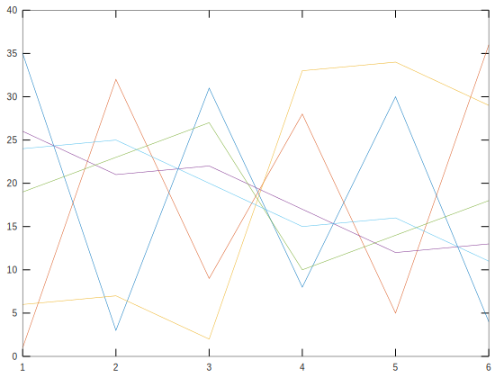
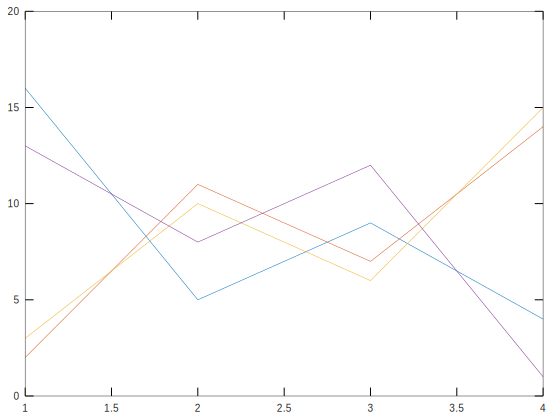

## Markdown

* Use `#`, `##`, etc. for headings.
* Use `*`, `**`, etc. for bullet points, or normal numbers for ordered lists.
* Surround text by two asterisks for `**bold**` and one asterisk for `*italic*`.
* Use single backticks for `monospace`.
* Use `> ` or four spaces at the beginning of a line for a block quote.
* Links look like this: `(google)[www.google.com]`.
* Images must go on their own line and look like this: ``.

# aasdf

###

$$a s d f a s d f$$


## bigheader

```{octave}
# Note how the pre block has newlines in it
magic(6)
```
<div>
    <div class="codeparent octave">
        <div class="stdout">
            <pre>
ans =

   35    1    6   26   19   24
    3   32    7   21   23   25
   31    9    2   22   27   20
    8   28   33   17   10   15
   30    5   34   12   14   16
    4   36   29   13   18   11


            </pre>
        </div>
    </div>
</div>

# same as before but with closing pre tag not indented

```{octave}
# Note how the pre block has newlines in it
magic(6)
```
<div>
    <div class="codeparent octave">
        <div class="stdout">
            <pre>
ans =

   35    1    6   26   19   24
    3   32    7   21   23   25
   31    9    2   22   27   20
    8   28   33   17   10   15
   30    5   34   12   14   16
    4   36   29   13   18   11


</pre>
        </div>
    </div>
</div>

# now let's try adding whitespace to pre lines

```{octave}
# Note how the pre block has newlines in it
magic(6)
```
<div>
    <div class="codeparent octave">
        <div class="stdout">
            <pre>
ans =
 
   35    1    6   26   19   24
    3   32    7   21   23   25
   31    9    2   22   27   20
    8   28   33   17   10   15
   30    5   34   12   14   16
    4   36   29   13   18   11
 
 
 
</pre>
        </div>
    </div>
</div>


asasdfasdf

**bold**
**bold**
*italic*


```{octave}
plot(magic(6))
```
<div>
    <div class="codeparent octave">
        <div class="display">
            <div class="display-data result-image-container" data-mime-type="image/svg+xml">
                
            </div>
        </div>
    </div>
</div>


```{octave}
plot(magic(4))
```
<div>
    <div class="codeparent octave">
        <div class="display">
            <div class="display-data result-image-container" data-mime-type="image/svg+xml">
                

            </div>

        </div>

    </div>
</div>
